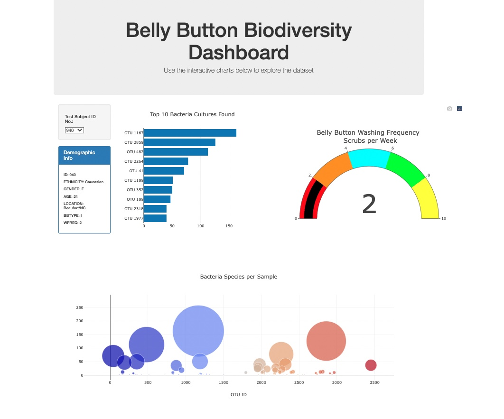

# Plotly-Belly-Button-Biodiversity

 The purpuse of this analisys is be able to visualize the bacterial data for each volunteer in order to identify whether a species is found in their navel.

 

 
